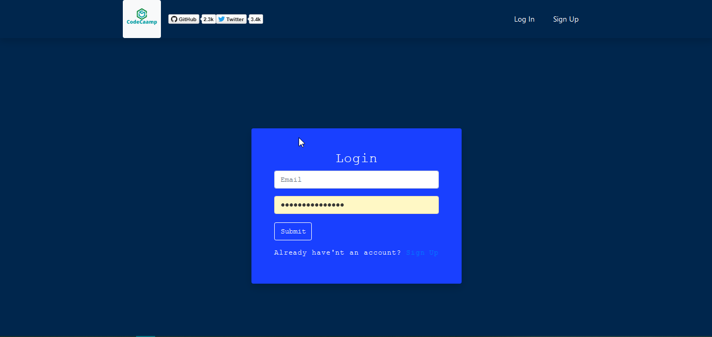

<h1 align="center">

[React_social_media_platform](https://laughing-swanson-750b20.netlify.app/)
</h1>

<div align="center" id="top"> 
  
  &#xa0;

  <!-- <a href="https://react_codeing_social_platform.netlify.app">Demo</a> -->
</div>

## [current Version ](https://laughing-swanson-750b20.netlify.app/)

<p align="center">
  

  

  

  

  

  

  
</p>


<h4 align="center"> 
	🚧  React_codeing_social_platform 🚀 Under construction...  🚧
</h4> 

<hr>

<p align="center">
  <a href="#dart-about">About</a> &#xa0; | &#xa0; 
  <a href="#sparkles-features">Features</a> &#xa0; | &#xa0;
  <a href="#rocket-technologies">Technologies</a> &#xa0; | &#xa0;
  <a href="#white_check_mark-requirements">Requirements</a> &#xa0; | &#xa0;
  <a href="#checkered_flag-starting">Starting</a> &#xa0; | &#xa0;
  <a href="#memo-license">License</a> &#xa0; | &#xa0;
  <a href="https://github.com/{{YOUR_GITHUB_USERNAME}}" target="_blank">Author</a>
</p>

<br>

## :dart: About ##

The idea is :fire: lot's of programmer are going to worngtrack by addiction of youtube click missguide ,,,
we will make a spacific social media where we can post our tutorial and learn about programming some good stuff that ....currently i need someone help to build that please fell free to connect&fork lets build together 

## :sparkles: Features ##

:heavy_check_mark: Programming Related Post   PostCrate , Edit , Update , Delete;\
:heavy_check_mark: User Authentication With Firebase Also(GooglePopUp signin,FacebookPopUp signin);\
:heavy_check_mark: Like post , share post ,Comment  a Post ;

## :rocket: Technologies ##

The following tools were used in this project:

- [Firebase](https://console.firebase.google.com)
- [Node.js](https://nodejs.org/en/)
- [React](https://pt-br.reactjs.org/)


## :white_check_mark: Requirements ##

Before starting :checkered_flag:, you need to have [Git](https://git-scm.com) and [Node](https://nodejs.org/en/) installed.

## :checkered_flag: Starting ##

```bash
# Clone this project
$ git clone https://github.com/pip-pipo/React_little_project


## dependencies ▶

{
  "name": "client",
  "version": "0.1.0",
  "private": true,
  "dependencies": {
    "@testing-library/jest-dom": "^5.11.9",
    "@testing-library/react": "^11.2.3",
    "@testing-library/user-event": "^12.6.0",
    "bootstrap": "^4.5.3",
    "firebase": "^8.2.3",
    "react": "^17.0.1",
    "react-dom": "^17.0.1",
    "react-icon": "^1.0.0",
    "react-icons": "^4.1.0",
    "react-router-dom": "^5.2.0",
    "react-scripts": "4.0.1",
    "web-vitals": "^0.2.4"
  },
  "scripts": {
    "start": "react-scripts start",
    "build": "react-scripts build",
    "test": "react-scripts test",
    "eject": "react-scripts eject"
  },
  "eslintConfig": {
    "extends": [
      "react-app",
      "react-app/jest"
    ]
  },
  "browserslist": {
    "production": [
      ">0.2%",
      "not dead",
      "not op_mini all"
    ],
    "development": [
      "last 1 chrome version",
      "last 1 firefox version",
      "last 1 safari version"
    ]
  }
}

```

## :memo: License ##

This project is under license from MIT. For more details, see the [LICENSE](LICENSE.md) file.


Made with :heart: by <a href="https://github.com/pip-pipo" target="_blank">Md Morsalin</a>

&#xa0;

<a href="#top">Back to top</a>
